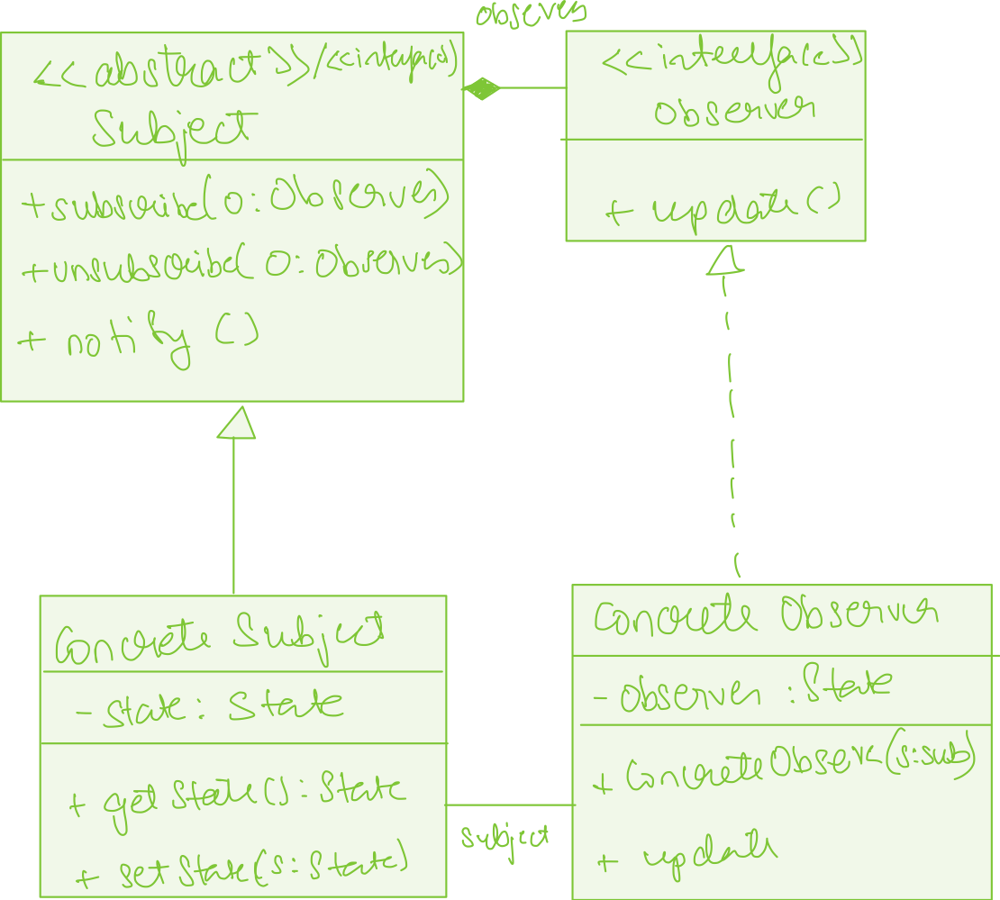

## Design participants

The observer pattern has four participants.

**Subject** – It can be an interface or abstract class defining the operations for attaching and de-attaching observers to the subject.

**ConcreteSubject** – concrete Subject class. It maintains the state of the object and when a change in the state occurs it notifies the attached Observers.

**Observer** – It can be an interface or abstract class defining the operations to be used to notify this object.

**ConcreteObserver** – concrete Observer implementations.

## Notes

The relation between subject and observer can be many to many.

**Benefits** : The subject and observers make a loosely coupled system. They do not need to know each other explicitly. We can independently add or remove observers at any time